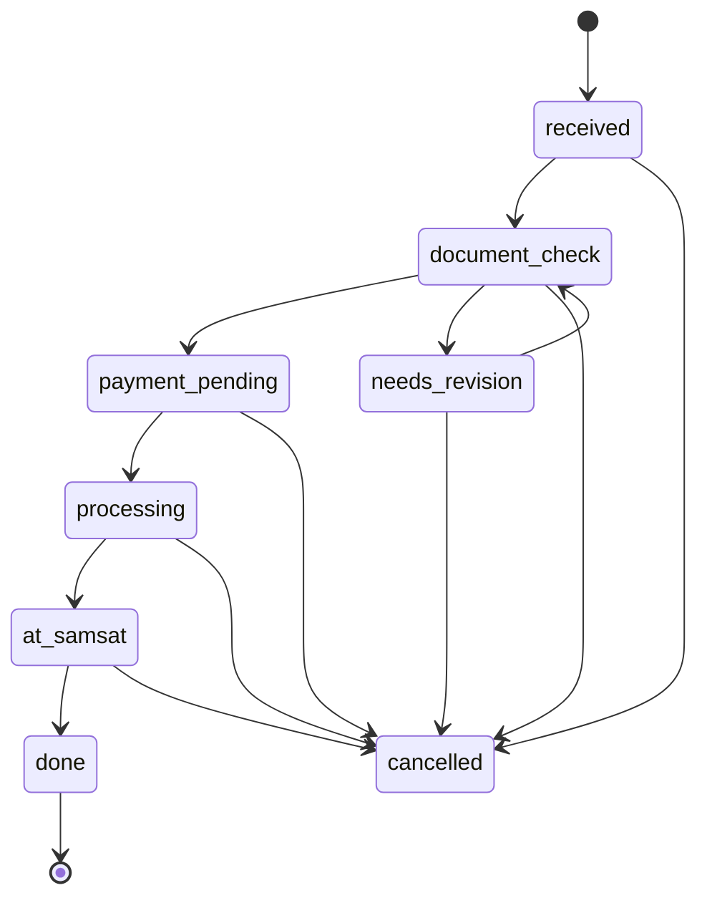

# SatuJasa STNK — Project Specification

## Overview

SatuJasa STNK is a multi-tenant SaaS platform for STNK administration agencies (biro jasa). It enables owners to manage tenants (branch offices), assign admin users, input vehicle document transactions, and provide customer-facing monitoring pages.

## Tech Stack

| Layer | Technology |
|-------|-----------|
| Monorepo | npm workspaces |
| Backend | Express + TypeScript + Drizzle ORM + PostgreSQL |
| Frontend Web | React + Vite + Tailwind CSS + shadcn/ui |
| Mobile | Expo + React Native (Admin User only) |
| Shared Contracts | @stnk/contracts |
| Auth | Session-based (httpOnly cookie + JWT refresh) |
| IDs | UUID v7 (all PKs) |
| Deletion | Soft delete (deleted_at timestamp) |

## Roles

1. **Super Admin** — Global platform management (single user: the platform owner)
2. **Owner** — Biro jasa owner, can have multiple tenants limited by subscription
3. **Admin User** — Assigned to exactly one tenant under an owner

## Registration Flow

1. Owner mendaftar via `/auth/register`
2. Akun langsung **aktif** dengan subscription tier **Free**
3. Free tier: bisa login, lihat menu & dashboard (preview), tapi **tidak bisa**:
   - Assign admin user
   - Add tenant
   - Input transaksi
4. Untuk mengaktifkan fitur, Super Admin harus upgrade subscription owner

## Subscription Tiers

Managed manually by Super Admin (no payment gateway in Phase 1).

| Tier | Tenants | Admin Users | Capabilities |
|------|---------|-------------|--------------|
| Free | 0 | 0 | Login & dashboard preview only. Semua menu visible tapi action disabled. Tidak bisa create tenant, assign admin, atau input transaksi. |
| Pro | 1 | 1 | Full access, 1 tenant, 1 admin user |
| Plus | 3 | 3 (1 per tenant) | Full access, up to 3 tenants, masing-masing 1 admin user |
| Expert | Custom | Custom | Limits (max_tenants, max_admin_users) di-set oleh Super Admin per owner |

### Expert Tier Detail
- Super Admin set `max_tenants` dan `max_admin_users` secara custom saat assign subscription
- Bisa lebih dari 3 tenant sesuai kebutuhan owner
- Limit bisa diubah kapan saja oleh Super Admin

## Service Catalog (Daftar Layanan)

| # | Code | Name |
|---|------|------|
| 1 | `perpanjang-tahunan` | Perpanjang Tahunan STNK |
| 2 | `perpanjang-5tahun` | Perpanjang 5 Tahun (Ganti Plat) |
| 3 | `balik-nama` | Balik Nama (BBN-KB) Satu Samsat |
| 4 | `mutasi-keluar` | Mutasi Keluar (Cabut Berkas) |
| 5 | `mutasi-masuk` | Mutasi Masuk |
| 6 | `stnk-hilang` | STNK Hilang (Duplikat) |
| 7 | `bpkb-hilang` | BPKB Hilang (Duplikat) |
| 8 | `rubah-warna` | Rubah Warna / Bentuk |
| 9 | `kendaraan-baru` | Kendaraan Baru (Daftar Pertama) |
| 10 | `blokir-unblokir` | Blokir / Unblokir STNK |
| 11 | `nopol-pilihan` | Nopol Pilihan (Plat Cantik) |

Services can be enabled/disabled per tenant. Pricing set by owner or admin user per tenant.

### Biaya Jasa Hierarchy (Pricing Rules)

1. **Owner** bisa set harga jasa ke **seluruh tenant** sekaligus (bulk) atau **per tenant** individual
2. **Admin User** bisa set harga jasa khusus untuk **tenant-nya sendiri** saja
3. **Conflict resolution**: Jika Owner set harga global, lalu Admin User override per-tenant → yang berlaku adalah **harga per-tenant** (override menang)
4. Field `price_source` di `tenant_services` menandai siapa yang terakhir set harga: `owner` atau `admin-user`
5. Owner bisa reset harga tenant ke harga global kapan saja (override Admin User)

## Database Schema

### Entity Relationship

```
users ─┬─< tenants
       ├─< subscriptions (owner has one active)
       └─< transactions (created_by)

tenants ─┬─< tenant_services
         ├─< customers
         └─< transactions

services ─< tenant_services

transactions ─< transaction_status_log
```

### Tables

**users**
- id: UUID v7 PK
- email: varchar unique
- phone: varchar
- password_hash: varchar
- role: enum (super-admin, owner, admin-user)
- owner_id: UUID FK nullable (for admin-user → their owner)
- tenant_id: UUID FK nullable (for admin-user → their tenant)
- created_at, updated_at, deleted_at

**tenants**
- id: UUID v7 PK
- name: varchar
- owner_id: UUID FK → users
- created_at, updated_at, deleted_at

**subscriptions**
- id: UUID v7 PK
- owner_id: UUID FK → users
- tier: enum (free, pro, plus, expert)
- max_tenants: int
- max_admin_users: int
- activated_by: UUID FK → users (super admin)
- activated_at: timestamp
- created_at, updated_at, deleted_at

**services**
- id: UUID v7 PK
- code: varchar unique (slug)
- name: varchar
- description: text
- is_default: boolean
- created_at, updated_at, deleted_at

**tenant_services**
- id: UUID v7 PK
- tenant_id: UUID FK → tenants
- service_id: UUID FK → services
- price: numeric
- price_source: enum (owner, admin-user) — siapa yang terakhir set harga
- is_active: boolean
- created_at, updated_at, deleted_at

**customers**
- id: UUID v7 PK
- tenant_id: UUID FK → tenants
- name: varchar
- phone: varchar
- plate_number: varchar
- vehicle_type: varchar
- created_at, updated_at, deleted_at

**transactions**
- id: UUID v7 PK
- tenant_id: UUID FK → tenants
- customer_id: UUID FK → customers
- service_id: UUID FK → services
- created_by: UUID FK → users
- status: enum (received, document_check, payment_pending, processing, at_samsat, needs_revision, done, cancelled)
- total_cost: numeric
- additional_cost: numeric default 0
- notes: text
- monitoring_token: UUID unique
- created_at, updated_at, deleted_at

**transaction_status_log**
- id: UUID v7 PK
- transaction_id: UUID FK → transactions
- from_status: enum
- to_status: enum
- changed_by: UUID FK → users
- notes: text
- created_at

## Transaction State Machine



## API Endpoints (REST /api/v1/)

### Auth
- `POST /auth/register` — owner registration (enters Free tier, account immediately active)
- `POST /auth/login` — email/phone + password
- `POST /auth/logout` — clear session
- `POST /auth/refresh` — refresh JWT

### Super Admin
- `GET /admin/dashboard` — global stats (revenue, active owners/users)
- `GET/POST/PATCH /admin/owners` — manage owners
- `GET/POST/PATCH /admin/owners/:id/subscription` — manage subscription
- `GET/PATCH /admin/settings` — platform settings

### Owner
- `GET /owner/dashboard` — revenue per tenant & total, active berkas
- `GET/POST/PATCH/DELETE /owner/tenants` — CRUD tenants
- `GET/POST/PATCH/DELETE /owner/tenants/:id/admin-users` — CRUD admin users
- `GET/POST/PATCH /owner/tenants/:id/services` — tenant service pricing
- `POST /owner/services/bulk-pricing` — set harga jasa ke semua tenant sekaligus
- `POST /owner/transactions` — input transaction (select tenant)
- `GET /owner/transactions` — list all own transactions
- `PATCH /owner/transactions/:id/status` — update status

### Admin User
- `GET /admin-user/dashboard` — tenant revenue & stats
- `POST /admin-user/transactions` — input transaction (auto tenant)
- `GET /admin-user/transactions` — list own tenant transactions
- `PATCH /admin-user/transactions/:id/status` — update status
- `GET/PATCH /admin-user/tenant/services` — own tenant pricing

### Public
- `GET /monitoring/:token` — customer monitoring page data
- `GET /health` — service health check
- `GET /meta/roles` — available roles

## Frontend Pages (Web)

1. **Landing Page** — product info, benefits, features, CTA login/register
2. **Login Page** — email/phone + password
3. **Register Page** — owner registration only
4. **Dashboard** — role-specific panels (see Role section)
5. **Monitoring Page** — public, no auth, progress stepper

### Dashboard Menus per Role

**Super Admin:**
- Overview (revenue global, active owners count, active users count)
- Kelola Owner (list, detail, activate/deactivate)
- Kelola Subscription (upgrade/downgrade per owner)
- Revenue Report (filter by owner/tenant/month)
- Settings (service catalog master, platform config)

**Owner:**
- Overview (revenue total & per tenant, berkas aktif)
- Input Transaksi (form + select tenant)
- List Berkas (filter: tenant, status, date)
- Kelola Tenant (CRUD)
- Kelola Admin User (CRUD, limited by subs)
- Setting Jasa (pricing per tenant)
- Profile & Settings

**Admin User:**
- Overview (revenue tenant, berkas aktif/done)
- Input Transaksi (form, auto-assigned tenant)
- List Berkas (own tenant, filter status)
- Setting Jasa (own tenant pricing)
- Profile

## Mobile App (Admin User Only)

- Login
- Dashboard (tenant stats)
- Input Transaksi (quick form)
- List Berkas (active/done tabs)
- Detail Berkas + update status
- Settings (tenant info, service pricing)

## Monitoring Page + WhatsApp Template

**Monitoring Page** (`/monitoring/{monitoring_token}`):
- Service name
- Status progress stepper (visual)
- Total cost & additional cost
- Estimated completion
- No login required, read-only

**WhatsApp Template** (generated, not automated):
```
Halo {customer_name}, berikut update berkas Anda:

Layanan: {service_name}
Status: {current_status}
Biaya Total: Rp {total_cost}
{additional_cost > 0 ? "Biaya Tambahan: Rp " + additional_cost : ""}

Pantau progres: {monitoring_url}

Terima kasih - {tenant_name}
```

Link format: `https://wa.me/{customer_phone}?text={url_encoded_template}`

## Phase 1 Scope
- Auth (login/register/session)
- Subscription management by super admin
- CRUD tenant & admin user (respecting sub limits)
- Service catalog + tenant pricing
- Input transaction + state machine
- Monitoring page (public)
- WA template generation
- Dashboards per role

## Phase 2 (Deferred)
- Payment gateway integration
- Document upload (foto STNK, KTP, dll)
- Automated notifications (email/push/WA API)
- Reporting & export (PDF/Excel)
- Audit log detail
- Multi-language

## Permission Matrix

| Fitur | Super Admin | Owner (Free) | Owner (Pro/Plus/Expert) | Admin User |
|-------|:-----------:|:------------:|:-----------------------:|:----------:|
| Login | ✅ | ✅ | ✅ | ✅ |
| Lihat Menu & Dashboard | ✅ | ✅ (preview only) | ✅ | ✅ |
| Kelola Owner | ✅ | ❌ | ❌ | ❌ |
| Kelola Subscription | ✅ | ❌ | ❌ | ❌ |
| Buat Tenant | ✅ | ❌ | ✅ | ❌ |
| Buat Admin User | ✅ | ❌ | ✅ | ❌ |
| Buat Transaksi | ✅ | ❌ | ✅ | ✅ |
| Lihat Laporan | ✅ | ❌ (preview only) | ✅ | Tenant only |
| Setting Platform | ✅ | ❌ | ❌ | ❌ |
| Setting Jasa — per tenant | ✅ | ❌ | ✅ | ✅ (own tenant) |
| Setting Jasa — bulk semua tenant | ✅ | ❌ | ✅ | ❌ |
| Monitoring Page | Public | Public | Public | Public |

## Data Access Rules

```
Super Admin  → all data, no tenant filter
Owner        → tenants WHERE owner_id = current_user.id
               admin_users WHERE owner_id = current_user.id
               transactions WHERE tenant_id IN (owned tenants)
Admin User   → transactions WHERE tenant_id = current_user.tenant_id
               customers WHERE tenant_id = current_user.tenant_id
```

All queries MUST enforce tenant isolation at the middleware/repository level. No role can access data outside its scope regardless of URL manipulation.

## Security
- Tenant isolation on all queries
- Role-based access control middleware
- Rate limiting on auth endpoints
- Input validation (zod) on all endpoints
- Soft delete for recovery & audit
- No secrets in public groups
- CORS restricted to known origins

## Branching Convention
- All agent work: `agent/<role>/<task-name>`
- Merge to main: manual, requires explicit owner approval
